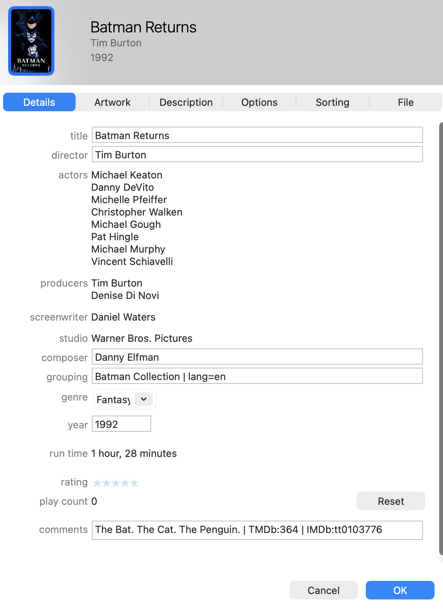
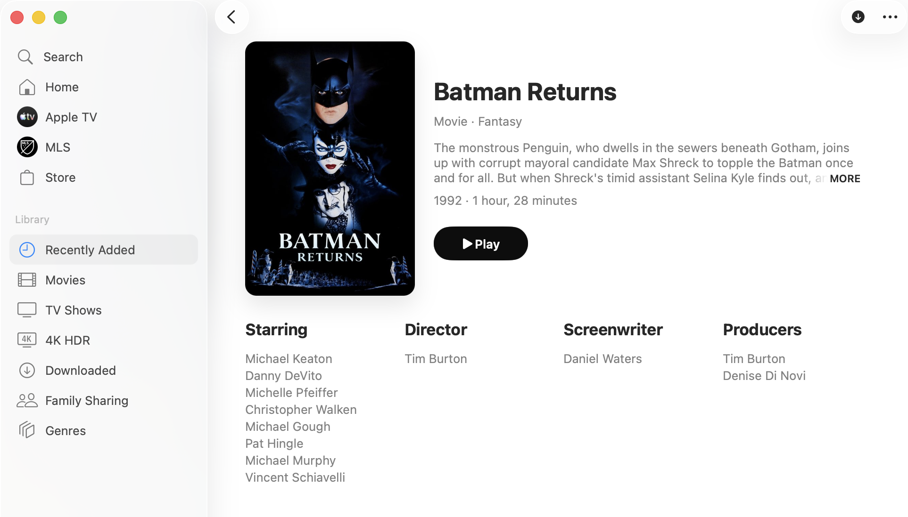

# Video Metadata Tagger

Generate high‑quality metadata for MP4/M4V movie and TV files using TMDb. It writes both standard MP4 tags and Apple‑specific iTunes metadata so titles look rich and complete in Apple TV and other Apple players.




## Quick Start

**Step 1 — Install Python dependencies**

```bash
python3 -m pip install -r requirements.txt
```

**Step 2 — Install required tools**

```bash
# macOS (Homebrew)
brew install ffmpeg mp4v2

# Ubuntu/Debian
sudo apt-get install ffmpeg mp4v2-utils

# Fedora
sudo dnf install ffmpeg mp4v2

# Windows (winget, PowerShell)
winget install Gyan.FFmpeg
winget install mp4v2
```

**Step 3 — Set your TMDb API key**

```bash
export TMDB_API_KEY="your_key_here"
```

**Step 4 — Run against a directory**

```bash
python3 -m video_metadata_tagger --root "/path/to/videos"
```

Or run a single file:

```bash
python3 -m video_metadata_tagger --file "/path/to/Batman Returns (1992).m4v"
```

## Tool Install

Install ffmpeg:

- macOS (Homebrew): `brew install ffmpeg`
- Ubuntu/Debian: `sudo apt-get install ffmpeg`
- Fedora: `sudo dnf install ffmpeg`
- Windows (winget): `winget install Gyan.FFmpeg`

Install mp4tags (mp4v2):

- macOS (Homebrew): `brew install mp4v2`
- Ubuntu/Debian: `sudo apt-get install mp4v2-utils`

Install mutagen:

- `python3 -m pip install mutagen`

## Capabilities

- **Matching**: Finds the best TMDb match for each file (movie or TV), with TV fallback.
- **Plan‑driven mapping**: JSON plans map provider fields to MP4/iTunes tags.
- **Artwork**: Downloads and embeds posters when enabled.
- **Standard + iTunes metadata**: Writes core MP4 tags plus iTunMOVI/Apple atoms for richer Apple TV displays.
- **Safety**: Optional backups, dry‑run/test modes, and rerun of failed files.
- **Logs**: Each run produces a concise log and a manifest for reruns.

Note: TMDb is the only provider currently configured, but the provider layer is designed to support additional metadata sources in the future.

## How It Works

1) Resolve target files from `--root` or `--file`.
2) Normalize title/year from filename and search TMDb.
3) Fetch provider data and apply mapping plans.
4) Write tags with ffmpeg/mp4tags/mutagen.
5) Save per‑run log + manifest for verification and reruns.

## Mapping Plans

Plans define:
- Provider endpoint + JSONPath sources
- Optional transforms
- Target MP4/iTunes keys
- Writer preference (ffmpeg vs mp4tags)

Plans:
- `core/mapping/movies/tmdb_itunes_movie_plan.json`
- `core/mapping/tv/tmdb_itunes_tv_plan.json`

Schemas (documentation only):
- `core/mapping/movies/tmdb_itunes_movie_plan.schema.json`
- `core/mapping/tv/tmdb_itunes_tv_plan.schema.json`

## Configuration

Defaults come from module config files. Override with a single `config.json` via `--config`.

Default config files:
- `core/providers/tmdb/config.json`
- `core/files/config.json`
- `core/matching_config.json`
- `ffmpeg/config.json`

### tmdb (`core/providers/tmdb/config.json`)
- `api_key_env` (default: `TMDB_API_KEY`)
- `api_key` (optional fallback)
- `language` (default: `en-US`)
- `include_adult` (default: `false`)
- `min_score` (default: `2.0`)
- `fallback_min_score` (default: `1.5`)
- `fallback_min_votes` (default: `10`)
- `request_delay_seconds` (default: `0.25`)
- `allow_tv_fallback` (default: `true`)

### scan (`core/files/config.json`)
- `extensions`
- `ignore_substrings`
- `max_files` (0 = no limit)

### matching (`core/matching_config.json`)
- `strip_tokens`
- `prefer_year_from_filename` (default: `true`)

### write (`ffmpeg/config.json`)
- `enabled` (default: `true`)
- `dry_run` (default: `false`)
- `override_existing` (default: `false`)
- `backup_original` (default: `false`)
- `backup_dir` (default: `logs`)
- `max_logs` (default: `20`)
- `backup_suffix` (default: `.bak`)
- `cover_art_enabled` (default: `true`)
- `cover_art_size` (default: `w500`)
- `ffmpeg_path` (default: `ffmpeg`)
- `mp4tags_path` (default: `mp4tags`)
- `metadata_tool` (`ffmpeg` or `mp4tags`, default: `mp4tags`)
- `rdns_namespace` (default: `local.tmdb`)
- `ffmpeg_analyzeduration` (default: `null`)
- `ffmpeg_probe_size` (default: `null`)
- `atomic_replace` (default: `true`)
- `test_mode` (`basic` or `verbose`)

## Usage Examples

Only process M4V files:

```bash
python3 -m video_metadata_tagger --root "/path/to/videos" --only-ext m4v
```

Override existing metadata values:

```bash
python3 -m video_metadata_tagger --root "/path/to/videos" --override-existing
```

Force TV matching for a run:

```bash
python3 -m video_metadata_tagger --root "/path/to/videos" --media-type tv
```

Restore metadata from a prior run:

```bash
python3 -m video_metadata_tagger --restore-backup logs/20250102-153000 --file "/path/to/movie.m4v"
```

Rerun failed files from a prior run:

```bash
python3 -m video_metadata_tagger --rerun-failed logs/20250102-153000
```

Inspect files and write a report:

```bash
python3 -m video_metadata_tagger inspect --root "/path/to/videos" --log /path/to/inspect.log
```

## Logs & Manifests

Each run creates a directory under `logs/` (unless running in test mode). The oldest logs are trimmed to keep at most `max_logs`.

Example:

```
logs/20250102-153000/
  manifest.jsonl
  20250102-153000.log
  My Movie.m4v.ffmeta
```

Files created per run:
- `manifest.jsonl` per‑file status and error reasons (for rerun‑failed)
- `<timestamp>.log` per‑run summary for quick confirmation and debugging
- `*.ffmeta` metadata snapshots for restore
- `*.bak` optional full‑file backups (disabled by default)

## Project Layout

- `core/` pipeline, mapping engine, transforms, models
- `core/mapping/` plan files and transforms
- `core/providers/` provider integrations (TMDb)
- `core/writers/` metadata writers (mp4tags, mutagen)
- `core/files/` scanning and path utilities
- `ffmpeg/` ffmpeg helpers and backups
- `config/` config loader and models
- `tests/` unit + integration tests

## Troubleshooting

- **mp4tags not found**: install it or set `write.mp4tags_path`.
- **ffmpeg not found**: install it or set `write.ffmpeg_path`.
- **Resource busy**: the script retries once automatically.
- **Wrong match**: raise `tmdb.min_score` or adjust matching tokens.
- **Artwork not updating**: rerun with `--override-existing`.
- **Apple TV shows stale metadata**: remove the item from your library and re‑add it.

## Contributing

1) Create a feature branch.
2) Keep changes focused and add tests where it makes sense.
3) Run tests:

```bash
python3 -m pytest -q tests/unit
```

4) If you touch TMDb integration, run integration tests (requires network + API key):

```bash
python3 -m pytest -q tests/integration
```

5) Open a PR with a clear summary and example output (log snippet or before/after screenshot).
